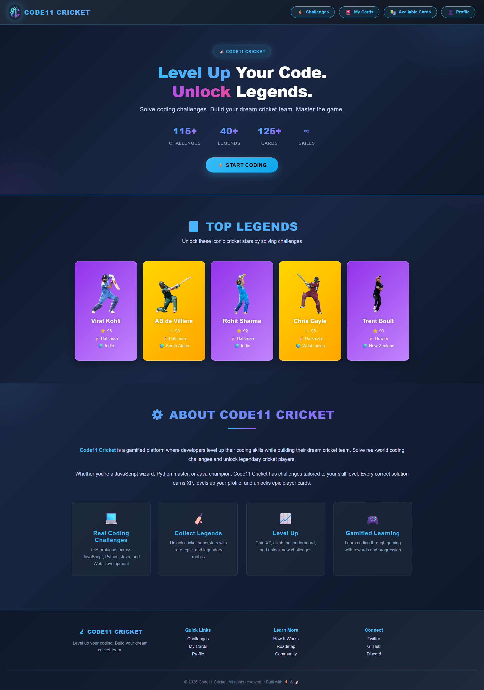
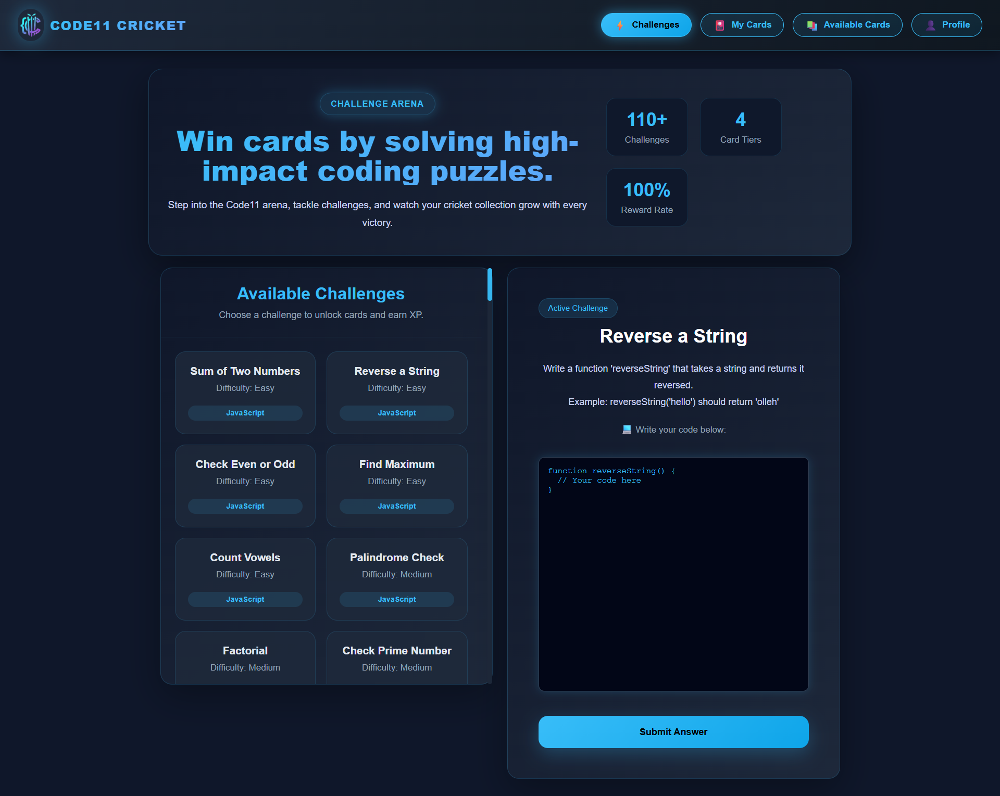
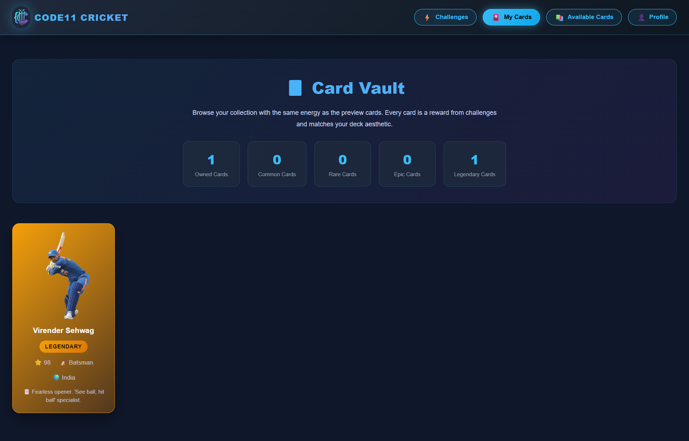
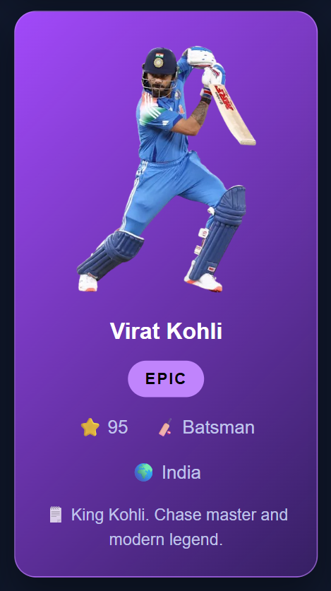

# 🏏 Code11 Cricket
**Level up your coding skills. Build your dream cricket team.**

Code11 Cricket ek unique aur interactive web platform hai jahan users coding challenges solve karke legendary cricket players ke cards unlock kar sakte hain. Ye project gamification aur learning ko combine karta hai.

---

## 🚀 Live Demo
Aap meri live project site yahan dekh sakte hain: 
👉 **[YAHAN APNA CLOUDFLARE LINK PASTE KAREIN]**

---

## ✨ Features

- **🏆 Challenge Arena:** 115+ logic-based coding puzzles solve karein aur rewards earn karein.
- **💎 Card Tiers:** Common, Rare, Epic, aur Legendary (e.g., Sir Don Bradman, Sachin Tendulkar) cards collect karein.
- **📊 Dynamic Stats:** Players ke roles ke hisaab se Batting aur Bowling ratings (OVR). All-rounders ke liye dual stats format.
- **🗃️ Card Vault:** Apne saare unlocked cards ko ek aesthetic grid layout mein manage karein.
- **📱 Responsive Design:** Mobile aur Desktop dono par ekdum smooth chalta hai.
- **🌑 Dark Aesthetic:** Modern dark-theme UI jo premium gaming experience deta hai.

---

## 📸 Screenshots

| Landing Page | Challenge Dashboard |
| :---: | :---: |
|  |  |

| Collection Vault | Player Card View |
| :---: | :---: |
|  |  |

---

## 🛠️ Tech Stack

- **Frontend:** HTML5, CSS3 (Modern Flexbox/Grid)
- **Scripting:** Vanilla JavaScript (ES6+) for logic and state management
- **Icons/Fonts:** FontAwesome & Google Fonts
- **Deployment:** Cloudflare Pages

---

## 📂 Project Structure

```text
code11-cricket/
├── img/                  # Player images, icons, aur logos
├── index.html            # Entry point (Landing Page)
├── challenges.html       # Coding challenges solving area
├── available-cards.html  # Total cards library
├── collection.html       # User ka personal unlocked deck
├── profile.html          # User statistics aur progress
└── style.css             # Global custom styling
```

## 🎮 How to Play
Enter the Game: Landing page par "Start Coding" par click karein.

- Solve Puzzles: Challenges section mein jayein aur logic-based questions solve karein.

- Unlock Legends: Har success par aapko cards milenge. Legendary players ke liye hard challenges solve karne honge!

- View Stats: Apne collection mein har player ki detail aur ratings check karein.

## 🔧 Installation & Local Setup
Agar aap ise apne local machine par chalana chahte hain:

- Repository clone karein:
```
git clone [https://github.com/IsaAnsari/code11-cricket.git](https://github.com/IsaAnsari/code11-cricket.git)
```
- Project folder mein jayein:
```
cd code11-cricket
```
index.html ko browser mein open karein (Ya VS Code ka Live Server use karein).

## 👤 Author
Isa Ansari

GitHub: [@IsaAnsari](https://github.com/IsaAnsari/)

Portfolio: [IsaFolio](https://isafolio.netlify.app/)

Developed with ❤️ for Cricket & Coding.
